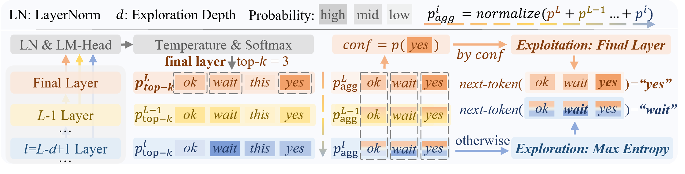

# 💡[arXiv2602] Restoring Exploration after Post-Training: Latent Exploration Decoding for Large Reasoning Models
Wenhui Tan<sup>1</sup> Fiorenzo Parascandolo<sup>2</sup> Enver Sangineto<sup>2</sup> Jianzhong Ju<sup>3</sup> Zhenbo Luo<sup>3</sup> Qian Cao<sup>1</sup> Rita Cucchiara<sup>2</sup> Ruihua Song<sup>1</sup> Jian Luan<sup>3</sup>

<sup>1</sup>Renmin University of China
<sup>2</sup>University of Modena and Reggio Emilia
<sup>3</sup>MiLM Plus, Xiaomi Inc.

<p>
  <a href="https://arxiv.org/abs/2602.01698">
    
  </a>
</p>


<p align="center">
  
</p>
<p align="center">
  
</p>


## ⚙️ Environment Setup

To set up the virtual environment for SGLang inference, execute each line:

```bash
conda create -n led python=3.11 -y && conda activate led
pip install --upgrade pip
pip install torch transformers accelerate jsonlines math_verify openai torch_memory_saver
pip install flash_attn --no-build-isolation # may take more time (20min). try `pip install flash_attn==2.7.3 --no-build-isolation` if find undefined symbol bug

# Install SGLang (0.4.6.post1) tailored for Latent Exploration Decoding
cd sglang_led_pkg
pip install -e "python[all]"
cd ..
```

## 🚀 Run LED and Baseline Methods
### Models and Datasets
Please modify the MODEL_PATH_DICT under `led/constants.py` to point to the path of your model. For the datasets, please refer to the [SoftThinking](https://github.com/eric-ai-lab/Soft-Thinking) repository for instructions on how to download and prepare them under ``./datasets``.
### Command:
```
python run_benchmarks.py \
--datasets=gsm8k,math500,aime2024,aime2025,gpqa_diamond,livecodebench \  # All dataset names separated by commas
--model_name=Qwen3-4B-Thinking-2507 \ #The key in MODEL_PATH_DICT
--latent_method=led
# --latent_method=dola --sub_method=low # for DoLa
# --enable_soft_thinking  # For SoftThinking
# --enable_soft_thinking --add_noise_gumbel_softmax # For SoftThikning-Gumbel
```

Other hyperparameters can be modified in `run_benchmarks.py`.


## 🪪 Licensing
This project utilizes a modified version of the [SGLang](https://github.com/sgl-project/sglang) library. The licensing structure is as follows:
- **Our Original Code**: The code original to this project (i.e. all code outside the `./sglang_led_pkg` directory) is licensed under the **MIT License**. A copy of the MIT License can be found in the root `LICENCE` file.

- **Modified SGLang and SoftThinking**: The code within the `./sglang_led_pkg` directory is a derivative work of `SGLang` (version 0.4.6.post1) and SoftThinking, and is therefore licensed under **Apache License 2.0**. The orginal Apache 2.0 license is included in the `./sglang_led_pkg/LICENSE` file.


## 📜 Citation
If you use this code or dataset, please cite our paper:
```bibtex
@article{tan2026led,
  title={Restoring Exploration after Post-Training: Latent Exploration Decoding for Large Reasoning Models},
  author={Tan, Wenhui and Parascandolo, Fiorenzo and Sangineto, Enver and Ju, Jianzhong and Luo, Zhenbo and Cao, Qian and Cucchiara, Rita and Song, Ruihua and Luan, Jian},
  journal={arXiv preprint arXiv:2602.01698},
  year={2026}
}
```

## Acknowledgements
We would like to thank the authors of [SGLang](https://github.com/sgl-project/sglang) and [SoftThinking](https://github.com/eric-ai-lab/Soft-Thinking) for their work on the SGLang library, which we have modified and extended for our research.
